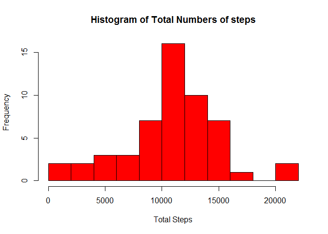
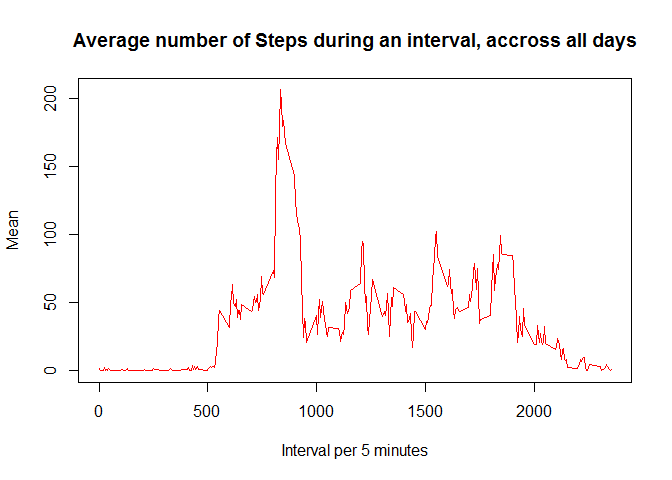
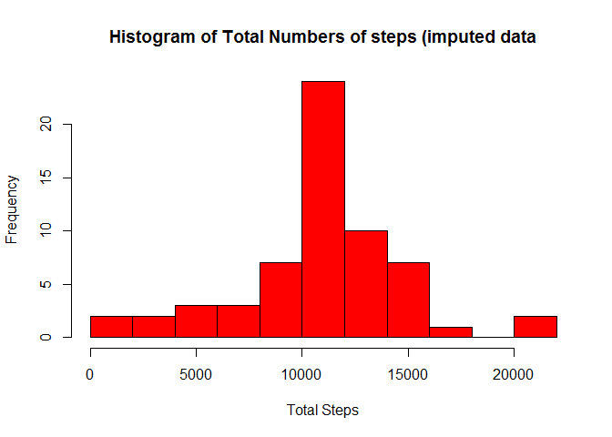
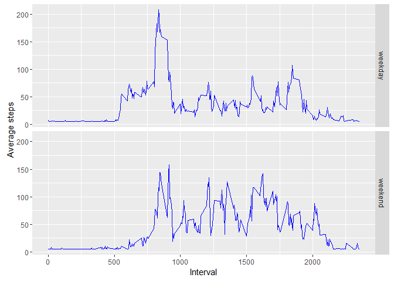

# Reproducible Research: Peer Assessment 1


## Loading and preprocessing the data
First of all, let's unzip the file, store it in a variable, and take a look at it.

```r
unzip(zipfile="activity.zip")
dat <- read.csv("activity.csv")
head(dat)
```

```
##   steps       date interval
## 1    NA 2012-10-01        0
## 2    NA 2012-10-01        5
## 3    NA 2012-10-01       10
## 4    NA 2012-10-01       15
## 5    NA 2012-10-01       20
## 6    NA 2012-10-01       25
```
It appears we have some missing values. Let's process it by filtering out these rows for now.

```r
data <- subset(dat, !is.na(steps))
head(data)
```

```
##     steps       date interval
## 289     0 2012-10-02        0
## 290     0 2012-10-02        5
## 291     0 2012-10-02       10
## 292     0 2012-10-02       15
## 293     0 2012-10-02       20
## 294     0 2012-10-02       25
```
All set!

## What is mean total number of steps taken per day?
This can be calculated using the tapply function, which will sum for us the steps per day. Here are the total number of steps for the first few days.

```r
totalPerDay <- tapply(data$steps, data$date, sum)
head(totalPerDay)
```

```
## 2012-10-01 2012-10-02 2012-10-03 2012-10-04 2012-10-05 2012-10-06 
##         NA        126      11352      12116      13294      15420
```

Now we plot a nice histogram (not a barplot) that indicates the distribution of the total numbers.

```r
hist(totalPerDay, breaks = 10, col = "red", xlab = "Total Steps", 
     main = "Histogram of Total Numbers of steps")
```



A summary tells us the mean is 10770 and the median is 10760.

```r
summary(totalPerDay)
```

```
##    Min. 1st Qu.  Median    Mean 3rd Qu.    Max.    NA's 
##      41    8841   10760   10770   13290   21190       8
```

## What is the average daily activity pattern?
Again we can use tapply here, this time grouping per interval and looking for the mean rather than the sum. Let's take a look at the mean values for the first few intervals. 

```r
meanPerInterval <- tapply(data$steps, data$interval, mean)
head(meanPerInterval)
```

```
##         0         5        10        15        20        25 
## 1.7169811 0.3396226 0.1320755 0.1509434 0.0754717 2.0943396
```

Plotting time!

```r
plot(unique(data$interval), meanPerInterval, type="l", col="red", 
     main ="Average number of Steps during an interval, accross all days",
     xlab = "Interval per 5 minutes", ylab = "Mean")
```



That huge peak draws our attention... With the help of the max function, we can subset out the 5 minutes with the highest average number of staps, which appears to be ~206. On 5 minutes. Crazy stuff.

```r
meanPerInterval[meanPerInterval == max(meanPerInterval)]
```

```
##      835 
## 206.1698
```
## Imputing missing values
Let us return now to the data with the missing values (stored in the variable dat). How many values are actually missing?

```r
sum(is.na(dat$steps))
```

```
## [1] 2304
```

Ok, the impute function of the Hisc package can be used to replace these 2304 NAs with the mean. We first take a look at that value, and then apply the impute function to create a new dataframe without NAs: imputedData.

```r
library(Hmisc)
mean(dat$steps, na.rm = TRUE)
```

```
## [1] 37.3826
```

```r
imputedData <- dat
imputedData$steps <- impute(dat$steps, mean)
```

If we check imputedData, all NAs will be removed (by this mean).

```r
head(imputedData)
```

```
##     steps       date interval
## 1 37.3826 2012-10-01        0
## 2 37.3826 2012-10-01        5
## 3 37.3826 2012-10-01       10
## 4 37.3826 2012-10-01       15
## 5 37.3826 2012-10-01       20
## 6 37.3826 2012-10-01       25
```

Now let's do exactly the same as before: creating a histogram and retrieve the mean and median by the summary function.

```r
totalPerDayI <- tapply(imputedData$steps, imputedData$date, sum)
hist(totalPerDayI, breaks = 10, col = "red", xlab = "Total Steps", 
     main = "Histogram of Total Numbers of steps (imputed data")
```



```r
summary(totalPerDayI)
```

```
##    Min. 1st Qu.  Median    Mean 3rd Qu.    Max. 
##      41    9819   10770   10770   12810   21190
```
Clearly, the center bar in the histogram has grown. All the NA values are now mean values, which explains the higher estimates for mean values according to this histogram. The rest of the histogram remains the same. Unsurprisingly, however, if we look at the summary, the mean was not affected by imputing, as we only added mean values. It is still 10770. But, the median is affected. By adding only mean values, the center value actually has been shifted to a mean value now, thus 10770.

## Are there differences in activity patterns between weekdays and weekends?
Now we'll use the imputed dataset to discover differences between weekdays and weekends. First we add a factor variable with weekday and weekend as levels. We do this by using the weekdays function on the dates, loop through theses values to change them, and then add them to imputedData as factors. As I live in Belgium, the daynames are in Dutch.

```r
days <- weekdays(as.Date(imputedData$date))
for(i in 1:length(days)) {
        if(days[i] %in% c("zaterdag", "zondag")) days[i] = "weekend"
        else days[i] = "weekday"
}
imputedData$day <- as.factor(days)
```

Before plotting we calculate the averages using the aggregate function. This will calculate the average number of steps per daytype (weekend or weekday) and per interval. Let's take a look at these averages.

```r
library(ggplot2)
averages <- aggregate(steps ~ interval + day, data=imputedData, mean)
head(averages)
```

```
##   interval     day    steps
## 1        0 weekday 7.006569
## 2        5 weekday 5.384347
## 3       10 weekday 5.139902
## 4       15 weekday 5.162124
## 5       20 weekday 5.073235
## 6       25 weekday 6.295458
```

Plotting time! I'll use ggplot because yolo.

```r
g <- ggplot(averages, aes(interval, steps))
g + geom_line(color="blue") + facet_grid(day ~ .) +
xlab("Interval") + ylab("Average steps")
```



One can see how these plots 'add up' to the previous (red) line plot. Then again, that plot is now 'splitted' into weekdays and weekends.

