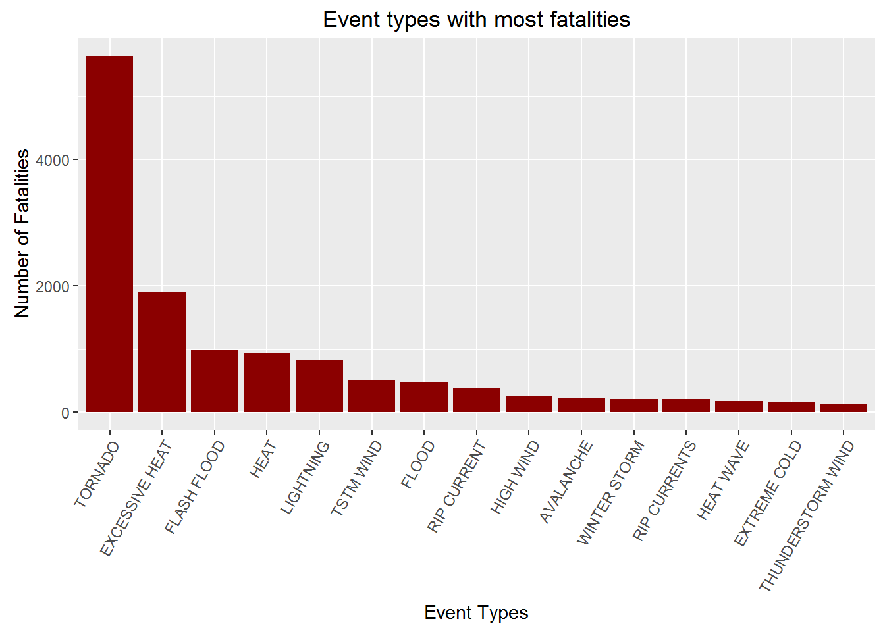
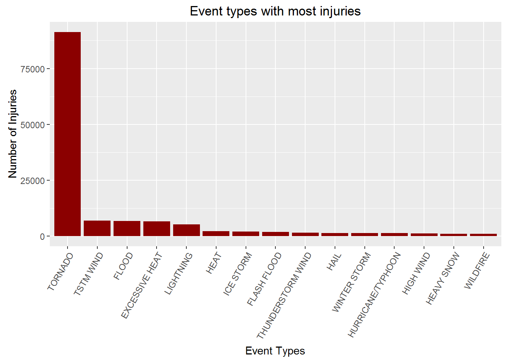
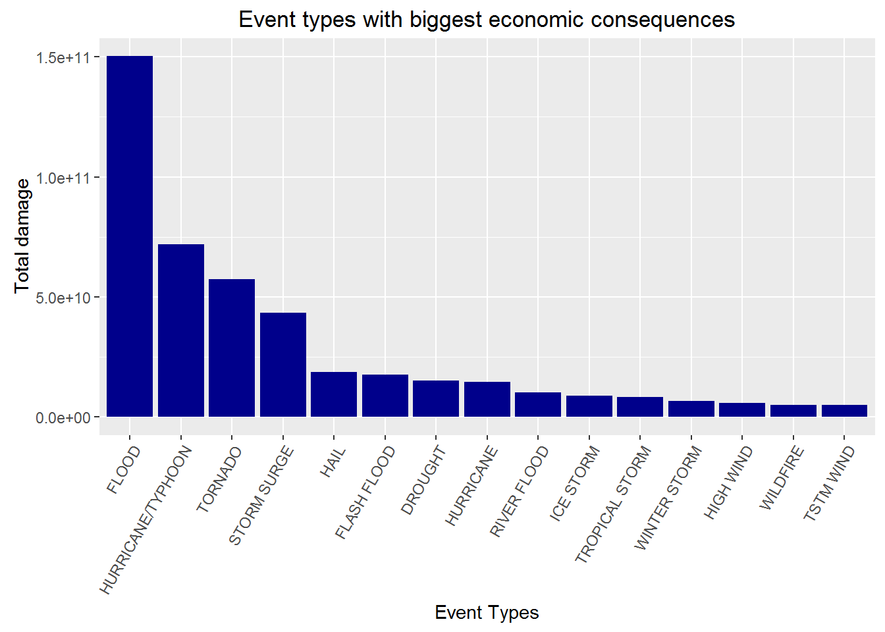

# Biggest weather causes of fatalities, injuries and economic damage in the US
Desiré De Waele  
25 februari 2016  
## Synopsis
Storms and other severe weather events can cause both public health and economic problems for communities and municipalities. Many severe events can result in fatalities, injuries, and property damage, and preventing such outcomes to the extent possible is a key concern.

This project involves exploring the U.S. National Oceanic and Atmospheric Administration's (NOAA) storm database. This database tracks characteristics of major storms and weather events in the United States, including when and where they occur, as well as estimates of any fatalities, injuries, and property damage.

This report handles two basic questions:

1. Across the United States, which types of events are most harmful with respect to population health?
2. Across the United States, which types of events have the greatest economic consequences?

## Data Processing
First of all, we download and read the data using download.file and read.csv respecitively.

```r
url <- "https://d396qusza40orc.cloudfront.net/repdata%2Fdata%2FStormData.csv.bz2"
download.file (url, destfile = "data.csv.bz2")
data <- read.csv ("data.csv.bz2")
```

Now we take a look at the data using the tbl_df function of the dplyr package.

```r
library(dplyr)
tbl_df(data)
```

```
## Source: local data frame [902,297 x 37]
## 
##    STATE__           BGN_DATE BGN_TIME TIME_ZONE COUNTY COUNTYNAME  STATE
##      (dbl)             (fctr)   (fctr)    (fctr)  (dbl)     (fctr) (fctr)
## 1        1  4/18/1950 0:00:00     0130       CST     97     MOBILE     AL
## 2        1  4/18/1950 0:00:00     0145       CST      3    BALDWIN     AL
## 3        1  2/20/1951 0:00:00     1600       CST     57    FAYETTE     AL
## 4        1   6/8/1951 0:00:00     0900       CST     89    MADISON     AL
## 5        1 11/15/1951 0:00:00     1500       CST     43    CULLMAN     AL
## 6        1 11/15/1951 0:00:00     2000       CST     77 LAUDERDALE     AL
## 7        1 11/16/1951 0:00:00     0100       CST      9     BLOUNT     AL
## 8        1  1/22/1952 0:00:00     0900       CST    123 TALLAPOOSA     AL
## 9        1  2/13/1952 0:00:00     2000       CST    125 TUSCALOOSA     AL
## 10       1  2/13/1952 0:00:00     2000       CST     57    FAYETTE     AL
## ..     ...                ...      ...       ...    ...        ...    ...
## Variables not shown: EVTYPE (fctr), BGN_RANGE (dbl), BGN_AZI (fctr),
##   BGN_LOCATI (fctr), END_DATE (fctr), END_TIME (fctr), COUNTY_END (dbl),
##   COUNTYENDN (lgl), END_RANGE (dbl), END_AZI (fctr), END_LOCATI (fctr),
##   LENGTH (dbl), WIDTH (dbl), F (int), MAG (dbl), FATALITIES (dbl),
##   INJURIES (dbl), PROPDMG (dbl), PROPDMGEXP (fctr), CROPDMG (dbl),
##   CROPDMGEXP (fctr), WFO (fctr), STATEOFFIC (fctr), ZONENAMES (fctr),
##   LATITUDE (dbl), LONGITUDE (dbl), LATITUDE_E (dbl), LONGITUDE_ (dbl),
##   REMARKS (fctr), REFNUM (dbl)
```

As part of processing the data, we want to change the header to lower case and select the relevant columns for the purpose of our research question. As we want to explore the relation between the type of event (evtype) and population health or economic consequences, we select the columns for event type, fatalities, injuries, property damage and crop damage. The propdmgexp and cropdmgexp variables are also needed as they indicate the scale of the damage values 

```r
names(data) <- tolower(names(data))
aData <- select(data, evtype, fatalities:cropdmgexp)
tbl_df(aData)
```

```
## Source: local data frame [902,297 x 7]
## 
##     evtype fatalities injuries propdmg propdmgexp cropdmg cropdmgexp
##     (fctr)      (dbl)    (dbl)   (dbl)     (fctr)   (dbl)     (fctr)
## 1  TORNADO          0       15    25.0          K       0           
## 2  TORNADO          0        0     2.5          K       0           
## 3  TORNADO          0        2    25.0          K       0           
## 4  TORNADO          0        2     2.5          K       0           
## 5  TORNADO          0        2     2.5          K       0           
## 6  TORNADO          0        6     2.5          K       0           
## 7  TORNADO          0        1     2.5          K       0           
## 8  TORNADO          0        0     2.5          K       0           
## 9  TORNADO          1       14    25.0          K       0           
## 10 TORNADO          0        0    25.0          K       0           
## ..     ...        ...      ...     ...        ...     ...        ...
```
These are the top rows of our analytic data.

## Results
### Relation between event type and population health
In order to show the total fatality and injury numbers per event type, we can apply the group_by and summarize function on our analytic data. Then we can arrange the new dataframe to already show some values.

```r
totalNumbers <- aData %>% 
        group_by(evtype) %>% 
        summarize(fatalities = sum(fatalities), injuries = sum(injuries)) %>%
        arrange(desc(fatalities))
tbl_df(totalNumbers)
```

```
## Source: local data frame [985 x 3]
## 
##            evtype fatalities injuries
##            (fctr)      (dbl)    (dbl)
## 1         TORNADO       5633    91346
## 2  EXCESSIVE HEAT       1903     6525
## 3     FLASH FLOOD        978     1777
## 4            HEAT        937     2100
## 5       LIGHTNING        816     5230
## 6       TSTM WIND        504     6957
## 7           FLOOD        470     6789
## 8     RIP CURRENT        368      232
## 9       HIGH WIND        248     1137
## 10      AVALANCHE        224      170
## ..            ...        ...      ...
```
Now we prepare small subsets of totalNumbers for plotting. Fatal contains the top ten event types for fatalities. However, the fatality values may be ordered now, but the levels of evtype are not. To plot nice descending bars in our barplot, we arrange the levels so that they correspond with the fatality values. Then we plot using the ggplot2 package.

```r
fatal <- arrange(totalNumbers, desc(fatalities))[1:10,]
fatal$evtype <- factor(fatal$evtype, levels = fatal$evtype[order(fatal$fatalities)])

library(ggplot2)
g <- ggplot(fatal, aes(evtype, fatalities))
g + geom_bar(stat="identity", fill = "darkred") + coord_flip() + 
        xlab("Event Types") + ylab("Number of Fatalities") + ggtitle("Event types with most fatalities")
```



Plotting the injury numbers is analogous. Injur contains the top ten event types for injuries. Again, we have to order the evtype levels.

```r
injur <- arrange(totalNumbers, desc(injuries))[1:10,]
injur$evtype <- factor(injur$evtype, levels = injur$evtype[order(injur$injuries)])

g <- ggplot(injur, aes(evtype, injuries))
g + geom_bar(stat="identity", fill = "darkred") + coord_flip() + 
        xlab("Event Types") + ylab("Number of Injuries") + ggtitle("Event types with most injuries")
```



Clearly, tornados are by far the most harmful for both fatalities and injuries. Excessive heat, flash food, heat and lightning seem to cause high numbers of fatalities as well, whereas tstm wind, flood, excessive heat and lightning are the biggest causes (after tornados) for injuries.

### Relation between event type and economic consequences
To address the question which event types have the biggest economic consequences, we will first subset our analytic data. We select only the economic related columns, and filter out the observations with no property or crop damage. This makes our dataset a whole lot smaller.

```r
damage <- aData %>% 
        select(evtype, propdmg:cropdmgexp) %>% 
        filter(propdmg != 0 | cropdmg != 0)
tbl_df(damage)
```

```
## Source: local data frame [245,031 x 5]
## 
##     evtype propdmg propdmgexp cropdmg cropdmgexp
##     (fctr)   (dbl)     (fctr)   (dbl)     (fctr)
## 1  TORNADO    25.0          K       0           
## 2  TORNADO     2.5          K       0           
## 3  TORNADO    25.0          K       0           
## 4  TORNADO     2.5          K       0           
## 5  TORNADO     2.5          K       0           
## 6  TORNADO     2.5          K       0           
## 7  TORNADO     2.5          K       0           
## 8  TORNADO     2.5          K       0           
## 9  TORNADO    25.0          K       0           
## 10 TORNADO    25.0          K       0           
## ..     ...     ...        ...     ...        ...
```

The next step is to change the propdmg and cropdmg values depending on their relevant exp values. "K" multiplies the damage values by 1.000, "M" does so by 1.000.000 and "B" does so by 1.000.000.000. In order to do this we first create logical vectors for each multiplier. By using these vectors, we can multiply the damage values with the correct factor. Note that we have to do this process two times, once for the property values and once for the crop values.

```r
# Changing the property damage values
kvector <- toupper(damage$propdmgexp)=="K"
mvector <- toupper(damage$propdmgexp)=="M"
bvector <- toupper(damage$propdmgexp)=="B"
damage[kvector,]$propdmg <- damage[kvector,]$propdmg * 10**3
damage[mvector,]$propdmg <- damage[mvector,]$propdmg * 10**6
damage[bvector,]$propdmg <- damage[bvector,]$propdmg * 10**9

# Changing the crop damage values
kvector <- toupper(damage$cropdmgexp)=="K"
mvector <- toupper(damage$cropdmgexp)=="M"
bvector <- toupper(damage$cropdmgexp)=="B"
damage[kvector,]$cropdmg <- damage[kvector,]$cropdmg * 10**3
damage[mvector,]$cropdmg <- damage[mvector,]$cropdmg * 10**6
damage[bvector,]$cropdmg <- damage[bvector,]$cropdmg * 10**9
```

Now that we have the correct damage numbers, we can start calculating the total damage per event type. First we group by event type, then apply summarize to sum both the propdmg and cropdmg values, lastly we arrange on total damage. All of this can be done using the dplyr package.

```r
damage <- damage %>% 
        group_by(evtype) %>% 
        summarize(totalDamage = sum(propdmg) + sum(cropdmg)) %>%
        arrange(desc(totalDamage))
tbl_df(damage)
```

```
## Source: local data frame [431 x 2]
## 
##               evtype  totalDamage
##               (fctr)        (dbl)
## 1              FLOOD 150319678257
## 2  HURRICANE/TYPHOON  71913712800
## 3            TORNADO  57352114049
## 4        STORM SURGE  43323541000
## 5               HAIL  18758221521
## 6        FLASH FLOOD  17562129167
## 7            DROUGHT  15018672000
## 8          HURRICANE  14610229010
## 9        RIVER FLOOD  10148404500
## 10         ICE STORM   8967041360
## ..               ...          ...
```

To plot these numbers we subset the top ten, and again we have to address the issue that the levels of evtype are not ordered by the amount of damage that they cause (despite the totalDamage variable being arranged). We do so with the second statement. Only then we can plot.

```r
dam <- damage[1:10,]
dam$evtype <- factor(dam$evtype, levels = dam$evtype[order(dam$totalDamage)])

g <- ggplot(dam, aes(evtype, totalDamage))
g + geom_bar(stat="identity", fill = "darkblue") + coord_flip() + xlab("Event Types") + 
        ylab("Total damage") + ggtitle("Event types with biggest economic consequences")
```



Floods are a clear winner here, followed by hurricanes, tornados and storm surges.
